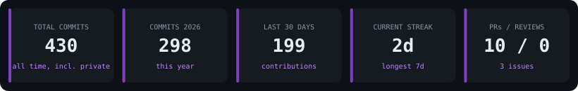
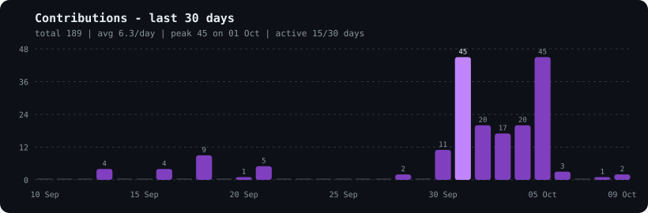

 

---

## 👨‍💻 About

I do **data-driven research in financial markets**: statistics, code, and disciplined experimentation to study market behaviour and build systematic trading ideas. A software-engineering background keeps my research **reproducible and testable**.

- 🔭 **Focus:** signal research, time-series modeling, backtesting, risk & portfolio evaluation
- 🧪 **Workflow:** idea → data → test → refine, simple explainable models first
- 🤝 **Open to:** collaborating on quant research, data analysis, and research tooling
- 📍 Jaipur, India

---

## 🛠️ Tech Stack

---

## 📊 Live GitHub Stats (self-generated every 6h · includes private repos)

---

## 🚀 Projects

Latest work is shown in the **Pinned** section right below this README. It updates the moment you pin or push, and GitHub handles it, so no code is needed.
👉 [All repositories, newest first](https://github.com/iamrahulmeena?tab=repositories&sort=updated)

---

## 🧭 Research Philosophy

- Markets are **probabilistic systems**, not deterministic ones
- **Process over prediction**
- **Simple, explainable models** before complexity
- Risk management is integral, not an afterthought
- Iterate on **data, not narratives**

---

*Systematic edges emerge from disciplined research, robust testing, and respect for uncertainty.*

